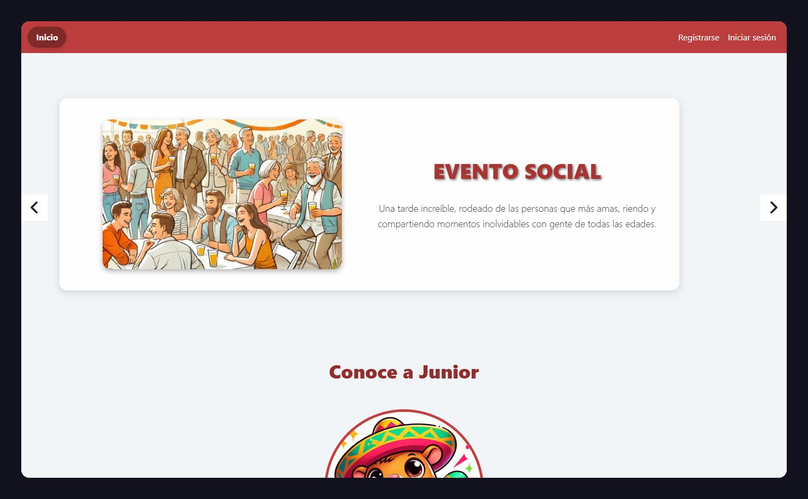

# Juntalia — Plataforma de eventos

Plataforma web para crear eventos, inscribirse, comentar y **descubrir lo que pasa cerca**, hecha con Laravel, Blade y la geolocalización del navegador.



## Funcionalidades

- **Eventos cercanos**: con permiso del navegador, la página de inicio muestra los eventos a menos de 10 km, ordenados del más cercano al más lejano.
- **Eventos**: crear, editar y eliminar eventos propios, con categoría, ciudad, fecha, costo, restricción de edad, dirección y ubicación.
- **Inscripciones**: inscribirse y anular la inscripción, sin duplicados.
- **Comentarios** en cada evento.
- **Panel de administración**: usuarios, roles, ciudades y eventos, con reportes en PDF y Excel y gráficas de eventos por categoría e inscripciones por evento.


## Cómo funciona la búsqueda por cercanía

El navegador entrega la ubicación del usuario y el servidor calcula la distancia a cada evento con la **fórmula de Haversine** directamente en SQL:

```php
$events = Event::selectRaw("
        *,
        (6371 * acos(
            cos(radians(?)) * cos(radians(lat)) *
            cos(radians(lng) - radians(?)) +
            sin(radians(?)) * sin(radians(lat))
        )) AS distancia", [$latitud, $longitud, $latitud])
    ->having('distancia', '<', 10)
    ->orderBy('distancia')
    ->get();
```


## Stack

| Parte | Tecnología |
|---|---|
| Aplicación principal | Laravel 10, PHP 8.1, Blade, MySQL, JavaScript |
| Reportes | `barryvdh/laravel-dompdf`, `maatwebsite/excel` |
| Panel de usuarios | React 19, React Router, React Bootstrap, Vite |

## Estructura

```
proyecto-laravel-sancochotrifasico/juntalia/   Aplicación principal (Laravel + Blade)
proyecto-react-sancochotrifasico/juntalia/     Panel de usuarios en React
```

## Puesta en marcha

**Aplicación principal** (requiere PHP 8.1+, Composer y MySQL):

```bash
cd proyecto-laravel-sancochotrifasico/juntalia
composer install
cp .env.example .env          # configurar la conexión a MySQL
php artisan key:generate
php artisan migrate --seed
php artisan serve
```

**Panel en React** (requiere Node.js):

```bash
cd proyecto-react-sancochotrifasico/juntalia
npm install
npm run dev
```

**Usuarios de prueba** (creados por los seeders):

| Rol | Correo | Contraseña |
|---|---|---|
| Usuario | `john.doe@example.com` | `1234` |
| Administrador | `gaby.frank@example.com` | `1243` |


## Equipo

- **Cristian Andrés Arenas Vargas**: interfaz en Blade y módulo de eventos e inscripciones, incluida la búsqueda por cercanía. [Portafolio](https://portfolio-3d-ca.vercel.app)
- David Espitia Zapata
- Gabriel Eduardo Franco Obando
